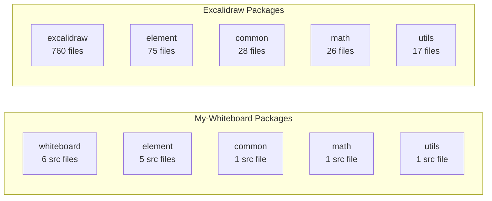
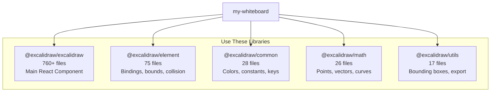
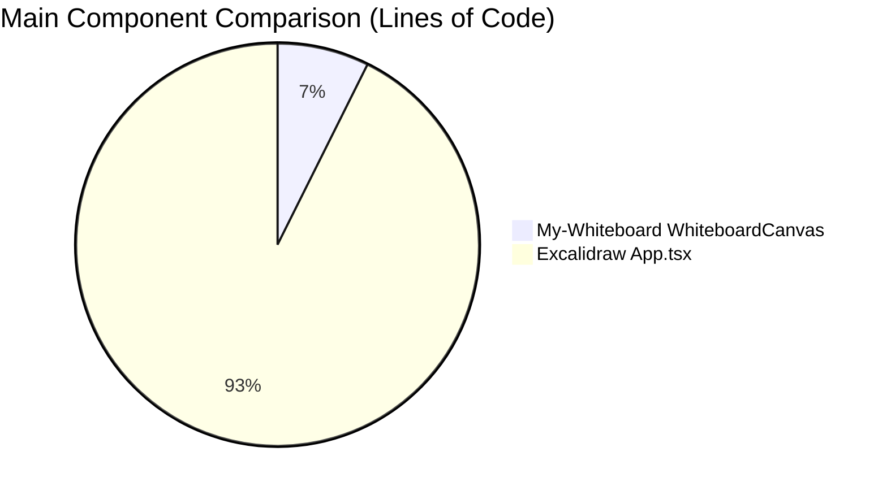

# My-Whiteboard Implementation Report

**Generated:** 2026-02-02  
**Reference:** Excalidraw Project (Parent Repository)

---

## Executive Summary

My-Whiteboard is a simplified implementation of a whiteboard application inspired by Excalidraw. This report analyzes what has been implemented vs what remains to be added compared to the parent Excalidraw project.

> [!IMPORTANT]
> **Implementation Status:** ~5-10% of Excalidraw's feature set implemented  
> **Total Lines of Code:** ~2,400 lines vs Excalidraw's ~150,000+ lines

---

## 1. Project Structure Comparison

### Monorepo Architecture

| Aspect | My-Whiteboard | Excalidraw |
|--------|---------------|------------|
| **Package Manager** | Yarn 1.22 | Yarn 1.22 |
| **Build Tool** | Vite 5.2 | Vite 5.1 |
| **Test Framework** | Vitest 1.4 | Vitest |
| **TypeScript** | 5.4 | 5.9.3 |
| **State Management** | Jotai | Jotai |
| **Rendering** | RoughJS | RoughJS |

### Package Comparison

| Package | My-Whiteboard | Excalidraw | Ratio |
|---------|---------------|------------|-------|
| **whiteboard/excalidraw** | 6 files (~41KB) | 760 files | 0.8% |
| **element** | 5 files (~28KB) | 75 files | 6.7% |
| **common** | 1 file (~6KB) | 28 files | 3.6% |
| **math** | 1 file (~5KB) | 26 files | 3.8% |
| **utils** | 1 file (~3.7KB) | 17 files | 5.9% |

---

## 2. Feature Implementation Strategy

> [!IMPORTANT]
> **Key Insight:** Instead of implementing features from scratch, my-whiteboard should **USE the Excalidraw library packages** to gain instant access to 760+ files of battle-tested functionality.

### Available Excalidraw Library Packages

### Features Available by Using `@excalidraw/excalidraw`

| Feature | Library Source | Import & Use |
|---------|----------------|--------------|
| **All Drawing Tools** | `@excalidraw/excalidraw` | ✅ Use `<Excalidraw />` component |
| **Frame Tool** | `@excalidraw/element` | ✅ `frame.ts` (26KB) |
| **Element Bindings** | `@excalidraw/element` | ✅ `binding.ts` (81KB) |
| **Elbow Arrows** | `@excalidraw/element` | ✅ `elbowArrow.ts` (64KB) |
| **Flowcharts** | `@excalidraw/element` | ✅ `flowchart.ts` (19KB) |
| **Groups** | `@excalidraw/element` | ✅ `groups.ts` (14KB) |
| **Text Wrapping** | `@excalidraw/element` | ✅ `textWrapping.ts` |
| **Collision Detection** | `@excalidraw/element` | ✅ `collision.ts` (20KB) |
| **Bounds Calculation** | `@excalidraw/element` | ✅ `bounds.ts` (33KB) |

### Features Available by Using `@excalidraw/math`

| Feature | Function | Import |
|---------|----------|--------|
| Point operations | `point.ts` (6KB) | ✅ Ready to use |
| Vector math | `vector.ts` (4KB) | ✅ Ready to use |
| Curve calculations | `curve.ts` (12KB) | ✅ Ready to use |
| Ellipse math | `ellipse.ts` (6KB) | ✅ Ready to use |
| Polygon operations | `polygon.ts` (2KB) | ✅ Ready to use |
| Segment handling | `segment.ts` (4KB) | ✅ Ready to use |
| Angle utilities | `angle.ts` (1.8KB) | ✅ Ready to use |

### Features Available by Using `@excalidraw/utils`

| Feature | Function | Import |
|---------|----------|--------|
| Bounding box | `bbox.ts` | ✅ Ready to use |
| Shape utilities | `shape.ts` (15KB) | ✅ Ready to use |
| Export helpers | `export.ts` (5.8KB) | ✅ Ready to use |
| Within bounds check | `withinBounds.ts` (5.7KB) | ✅ Ready to use |

### Features Available by Using `@excalidraw/common`

| Feature | Function | Import |
|---------|----------|--------|
| Color palette | `colors.ts` (9.5KB) | ✅ Ready to use |
| Keyboard keys | `keys.ts` (3.9KB) | ✅ Ready to use |
| Constants | `constants.ts` (14KB) | ✅ Ready to use |
| Utility functions | `utils.ts` (34KB) | ✅ Ready to use |
| Event emitter | `emitter.ts` | ✅ Ready to use |
| Font metadata | `font-metadata.ts` (4.7KB) | ✅ Ready to use |

---

### Current Implementation Status (Custom Code)

My-whiteboard currently has **custom implementations** instead of using libraries:

| Feature | Current | Better Approach |
|---------|---------|-----------------|
| Drawing tools | ✅ Custom (968 lines) | Use `<Excalidraw />` component |
| Element types | ✅ Custom (136 lines) | Import from `@excalidraw/element` |
| Math utils | ✅ Custom (189 lines) | Import from `@excalidraw/math` |
| Color palette | ✅ Custom (31 colors) | Import from `@excalidraw/common` |
| Renderer | ✅ Custom (414 lines) | Use Excalidraw's optimized renderer |

### What's Actually Missing (Even with Libraries)

These require **custom implementation** even when using Excalidraw libraries:

| Feature | Why Custom Needed |
|---------|-------------------|
| **Backend Collaboration** | Firebase/WebSocket setup is app-specific |
| **Authentication** | User auth is app-specific |
| **Cloud Storage** | File storage integration is custom |
| **Custom Branding** | Theme/styling customization |
| **Analytics** | Optional, app-specific tracking |

---

## 3. Code Architecture Comparison

### Main Component Size

### Rendering Pipeline

| Stage | My-Whiteboard | Excalidraw |
|-------|---------------|------------|
| **renderScene** | 1 file (414 lines) | Multiple files + caching |
| **Element Rendering** | Direct draw | Shape caching, generators |
| **Selection Rendering** | Basic box + handles | Advanced transforms |
| **Grid Rendering** | Simple lines | Optimized tiles |

### State Management

| Aspect | My-Whiteboard | Excalidraw |
|--------|---------------|------------|
| **Store** | Single Jotai store | Multiple stores + Context |
| **Atoms** | 8 atoms | 30+ atoms |
| **Derived State** | 3 derived atoms | Many computed values |
| **History** | Simple array | Fractional indexing |

---

## 4. File-by-File Analysis

### packages/whiteboard/src/

| File | Lines | Purpose | Completeness |
|------|-------|---------|--------------|
| `index.tsx` | 968 | Main component | Core complete, missing many interactions |
| `renderer/renderScene.ts` | 414 | Canvas rendering | Basic rendering, no optimization |
| `state/atoms.ts` | 115 | State atoms | Complete for current features |
| `state/history.ts` | 140 | Undo/redo | Basic implementation |

### packages/element/src/

| File | Lines | Purpose | Completeness |
|------|-------|---------|--------------|
| `types.ts` | 136 | Type definitions | Good coverage |
| `elementFactory.ts` | 222 | Element creation | Basic, missing many utilities |
| `textMeasurements.ts` | 6072B | Text measuring | Complete |
| `textWrapping.ts` | 12203B | Text wrapping | Complete |

### packages/common/src/

| File | Lines | Purpose | Completeness |
|------|-------|---------|--------------|
| `index.ts` | 227 | Utilities & constants | Fair coverage |

### packages/math/src/

| File | Lines | Purpose | Completeness |
|------|-------|---------|--------------|
| `index.ts` | 189 | Math utilities | Good for basic ops |

### packages/utils/src/

| File | Lines | Purpose | Completeness |
|------|-------|---------|--------------|
| `index.ts` | 123 | Export/clipboard/storage | Stubs mostly |

---

## 5. Implementation Roadmap

### Phase 1: Core Stability (Priority: High)

- [ ] Implement eraser tool functionality
- [ ] Add element rotation UI (rotation handles)
- [ ] Implement copy/paste operations
- [ ] Add keyboard shortcut Ctrl+Z/Y for undo/redo
- [ ] Fix image element support

### Phase 2: Enhanced Drawing (Priority: Medium)

- [ ] Element groups (Ctrl+G to group)
- [ ] Element locking UI
- [ ] Frame tool for organizing
- [ ] Better arrow/line connections (bindings)
- [ ] Context menu (right-click)

### Phase 3: Export/Import (Priority: Medium)

- [ ] Full PNG export with options
- [ ] Proper SVG export
- [ ] JSON import/export with validation
- [ ] Element library system

### Phase 4: Collaboration (Priority: Low for MVP)

- [ ] WebSocket/Firebase integration
- [ ] Live cursor display
- [ ] User presence indicators
- [ ] Room management

### Phase 5: Polish (Priority: Low)

- [ ] Mobile/touch support
- [ ] Accessibility (ARIA)
- [ ] i18n support
- [ ] PWA/offline mode
- [ ] Command palette

---

## 6. Technical Debt & Improvements

### Current Issues

| Issue | Severity | Description |
|-------|----------|-------------|
| No action system | Medium | All logic in main component |
| No element caching | Low | Re-renders everything |
| No input validation | Low | JSON import not validated |
| Console.log statements | Low | Debug statements in code |
| Eraser tool stub | Medium | Button exists, no function |

### Recommended Refactoring

1. **Extract Actions** - Move tool handlers to separate action files
2. **Add Element Cache** - Cache RoughJS drawings for performance
3. **Modularize Rendering** - Separate render functions by element type
4. **Add Tests** - Currently minimal test coverage
5. **Remove Debug Logs** - Clean up console.log statements

---

## 7. Metrics Summary

| Metric | My-Whiteboard | Excalidraw | Coverage |
|--------|---------------|------------|----------|
| **Total Source Files** | ~14 | ~900+ | ~1.5% |
| **Total Lines of Code** | ~2,400 | ~150,000+ | ~1.6% |
| **Element Types** | 7 | 10+ | ~70% |
| **Tools** | 10 | 15+ | ~67% |
| **Actions** | 0 (inline) | 44 files | 0% |
| **Components** | 4 | 242 | ~1.7% |
| **Test Files** | ~5 | 66+ | ~7.5% |
| **Languages** | 1 (EN) | 58 | ~1.7% |

---

## 8. Conclusion

My-Whiteboard successfully implements the **core drawing experience** of a whiteboard application:

### ✅ Working Well
- Basic shape drawing (rectangle, ellipse, diamond, line, arrow, freedraw, text)
- Element selection, resize, and drag operations
- Canvas zoom and pan
- Undo/redo
- Dark mode
- Properties panel

### ⚠️ Partially Implemented
- Export (PNG basic, SVG stub)
- Eraser tool (UI only)
- Rotation (data only)

### ❌ Not Implemented
- Real-time collaboration
- Element bindings/connections
- Image/embeddable support
- Frames and groups (UI)
- Library system
- Mobile support
- i18n

**Estimated Effort to Feature Parity:** 6-12 months of development for a single developer, or 2-4 months for a small team.

---

*This report was generated by analyzing the my-whiteboard codebase against the parent Excalidraw repository.*
