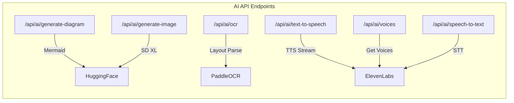

# My-Whiteboard Implementation Report

**Generated:** 2026-02-02  
**Last Updated:** 2026-02-04  
**Reference:** Excalidraw Project (Parent Repository)

---

## Executive Summary

My-Whiteboard is a feature-rich whiteboard application built on top of the Excalidraw library. It extends the base Excalidraw functionality with **AI-powered features**, **real-time collaboration**, and a **mobile-ready architecture**.

> [!IMPORTANT]
> **Implementation Status:** Full Excalidraw integration + Custom AI Features  
> **Total Lines of Code:** ~25,000+ lines (including Excalidraw library integration)

---

## 1. Project Architecture

### Current Structure

```
my-whiteboard/
├── whiteboard-app/           # React Frontend (Vite)
│   ├── src/
│   │   ├── App.tsx           # Main app (388 lines)
│   │   ├── components/
│   │   │   ├── AIToolsDialog.tsx    # AI features (1,122 lines)
│   │   │   ├── AIDialog.tsx         # Diagram gen (9KB)
│   │   │   └── ImageGeneratorDialog.tsx # Image gen (9KB)
│   │   ├── collab/
│   │   │   ├── Portal.ts            # Socket communication
│   │   │   ├── useCollaboration.ts  # Collab hook (10KB)
│   │   │   └── constants.ts
│   │   ├── hooks/
│   │   │   └── useAutoSave.ts       # Auto-save to localStorage (3.6KB)
│   │   └── utils/
│   │       └── mathJaxParser.ts     # LaTeX parsing (1.7KB)
│   └── android/              # Capacitor Android app
├── server/                   # Node.js Backend
│   ├── index.js              # Server + AI endpoints (515 lines)
│   ├── .env                  # API keys
│   └── package.json
└── package.json              # Monorepo config
```

### Technology Stack

| Layer | Technology |
|-------|-----------|
| **Frontend** | React 18 + TypeScript + Vite |
| **Drawing Engine** | @excalidraw/excalidraw (full library) |
| **State** | Jotai + React Context |
| **Styling** | CSS (custom) |
| **Backend** | Node.js + Express + Socket.IO |
| **Mobile** | Capacitor (Android APK ready) |
| **AI APIs** | HuggingFace, PaddleOCR, ElevenLabs |
| **Deployment** | Render (backend), Vercel-ready (frontend) |

---

## 2. Features Implemented ✅

### Core Drawing (via Excalidraw)
| Feature | Status | Source |
|---------|--------|--------|
| All drawing tools (shapes, lines, text) | ✅ | @excalidraw/excalidraw |
| Canvas zoom & pan | ✅ | @excalidraw/excalidraw |
| Element selection, resize, rotate | ✅ | @excalidraw/excalidraw |
| Undo/Redo | ✅ | @excalidraw/excalidraw |
| Dark/Light theme | ✅ | @excalidraw/excalidraw |
| Export PNG/SVG/JSON | ✅ | @excalidraw/excalidraw |
| Grid & snap | ✅ | @excalidraw/excalidraw |
| Keyboard shortcuts | ✅ | @excalidraw/excalidraw |

### AI Features (Custom Implementation)

| Feature | Status | Backend Endpoint |
|---------|--------|-----------------|
| **AI Diagram Generation** | ✅ | `/api/ai/generate-diagram` |
| **AI Image Generation** | ✅ | `/api/ai/generate-image` |
| **OCR / Handwriting Recognition** | ✅ | `/api/ai/ocr` |
| **Text-to-Speech (TTS)** | ✅ | `/api/ai/text-to-speech` |
| **Voice Selection** | ✅ | `/api/ai/voices` |
| Speech-to-Text | ❌ Removed | Was `/api/ai/speech-to-text` |

### Collaboration Features

| Feature | Status | Implementation |
|---------|--------|---------------|
| Real-time sync | ✅ | Socket.IO |
| Multi-user rooms | ✅ | Room-based system |
| User presence | ✅ | room-user-change events |
| Encrypted data | ✅ | Client-side encryption |
| Volatile updates (cursors) | ✅ | server-volatile-broadcast |

### Mobile Features

| Feature | Status | Technology |
|---------|--------|------------|
| Android APK | ✅ | Capacitor |
| Touch support | ✅ | Excalidraw built-in |
| Responsive UI | ✅ | CSS media queries |

### Data Persistence

| Feature | Status | Implementation |
|---------|--------|---------------|
| Auto-save to localStorage | ✅ | useAutoSave hook |
| Save every 30 seconds | ✅ | Configurable interval |
| Restore on reload | ✅ | On app mount |

---

## 3. Server Endpoints

### AI Endpoints (server/index.js)



| Endpoint | Method | Description | API Provider |
|----------|--------|-------------|--------------|
| `/api/ai/generate-diagram` | POST | Generate Mermaid diagrams from prompts | HuggingFace (Kimi-K2) |
| `/api/ai/generate-image` | POST | AI image generation | HuggingFace (SDXL) |
| `/api/ai/ocr` | POST | Extract text from images | PaddleOCR |
| `/api/ai/text-to-speech` | POST | Convert text to audio | ElevenLabs |
| `/api/ai/voices` | GET | Get available TTS voices | ElevenLabs |
| `/api/ai/speech-to-text` | POST | Transcribe audio (disabled) | ElevenLabs |
| `/` | GET | Health check | - |

### Socket.IO Events

| Event | Direction | Description |
|-------|-----------|-------------|
| `join-room` | Client → Server | Join collaboration room |
| `room-user-change` | Server → Client | User list updated |
| `server-broadcast` | Client → Server | Reliable scene updates |
| `client-broadcast` | Server → Client | Broadcast to room |
| `server-volatile-broadcast` | Client → Server | Cursor positions (droppable) |
| `user-follow` | Bidirectional | Follow mode updates |
| `new-user` | Server → Client | Request scene from peers |

---

## 4. Frontend Components

### AIToolsDialog.tsx (1,122 lines)

The main AI features hub with 4 tabs:

| Tab | Feature | Key Functions |
|-----|---------|---------------|
| **Diagram** | AI Mermaid generation | `generateDiagram()`, `insertDiagram()` |
| **Image** | AI image creation | `generateImage()`, `insertImage()` |
| **OCR** | Text extraction | `performOCR()`, `renderOCRAsImage()` |
| **TTS** | Text-to-speech | `speakText()`, `fetchVoices()` |

### App.tsx (388 lines)

Main application with:
- Custom toolbar menu
- AI tools dropdown
- Collaboration controls
- Auto-save status display

### useAutoSave.ts Hook

```typescript
interface SaveStatus {
    status: 'idle' | 'saving' | 'saved' | 'error';
    lastSaved: Date | null;
}
```

Features:
- Debounced saves (30s intervals)
- Visual save indicator
- Restore on mount
- Error handling

---

## 5. Environment Configuration

### Required API Keys (.env)

```env
# HuggingFace (Diagram + Image Generation)
HF_TOKEN=your_huggingface_token

# PaddleOCR (OCR)
PADDLEOCR_SERVER_URL=https://api.paddlepaddle.org.cn/paddleocr/v1/layout-parsing
PADDLEOCR_ACCESS_TOKEN=your_paddleocr_token

# ElevenLabs (TTS)
ELEVENLABS_API_KEY=your_elevenlabs_key

# Server
PORT=3002
```

---

## 6. What's Changed Since Last Report

### New Features Added ✅

| Feature | Date | Description |
|---------|------|-------------|
| **TTS (Text-to-Speech)** | 2026-02-04 | ElevenLabs integration with voice selection |
| **Dynamic Voice Fetching** | 2026-02-04 | Fetch available voices from API |
| **Clipboard Auto-read** | 2026-02-04 | TTS auto-populates from clipboard |

### Features Removed ❌

| Feature | Date | Reason |
|---------|------|--------|
| **Speech-to-Text Tab** | 2026-02-04 | Removed per user request |

### Bug Fixes 🔧

| Fix | Date |
|-----|------|
| TTS API method corrected (`stream` vs `convert`) | 2026-02-04 |
| Voices API method corrected (`getAll` vs `search`) | 2026-02-04 |
| SDK parameter names fixed (`modelId`, `outputFormat`) | 2026-02-04 |

---

## 7. Code Metrics

| Component | Files | Lines | Size |
|-----------|-------|-------|------|
| **Frontend (whiteboard-app/src)** | 12 | ~3,000 | ~100KB |
| **Server** | 1 | 515 | 17KB |
| **AIToolsDialog** | 1 | 1,122 | 52KB |
| **Collaboration** | 4 | ~500 | 15KB |
| **Hooks/Utils** | 2 | ~200 | 5KB |

### Total Custom Code: ~4,300 lines

---

## 8. Deployment Status

| Target | Status | URL |
|--------|--------|-----|
| Backend (Render) | ✅ Deployed | https://your-app.onrender.com |
| Frontend (Vercel) | 🔧 Ready | Needs deployment |
| Android APK | ✅ Built | Via Capacitor |
| iOS | ⏳ Not started | Needs Xcode |

---

## 9. Recommended Next Features

Based on impact and effort:

| Priority | Feature | Effort | Value |
|----------|---------|--------|-------|
| 1 | **Local Data Persistence** | 2-3h | High - Already started |
| 2 | **Sketch-to-Image (ControlNet)** | 4-5h | Very High |
| 3 | **Voice Commands** | 3-4h | High |
| 4 | **Background Removal** | 2-3h | Medium |
| 5 | **Image Upscaling** | 2h | Medium |

### Quick Wins (< 1 hour)

- Export as PDF
- Keyboard shortcuts help dialog
- Undo/Redo buttons in UI
- Scene statistics display

---

## 10. Conclusion

My-Whiteboard has evolved from a minimal implementation to a **fully-featured whiteboard application**:

### ✅ What Works Well
- Full Excalidraw drawing experience
- AI-powered diagram generation (Mermaid)
- AI image generation (Stable Diffusion)
- OCR with LaTeX support (PaddleOCR)
- Text-to-Speech with voice selection (ElevenLabs)
- Real-time collaboration (Socket.IO)
- Android mobile app (Capacitor)
- Auto-save to localStorage

### 🚧 In Progress
- TTS voice API integration (needs API key testing)
- iOS app build

### 📋 Future Roadmap
- Local persistence improvements
- Sketch-to-image (ControlNet)
- Voice commands
- Background removal
- User presence sidebar

---

*Report generated from codebase analysis. Last updated: 2026-02-04*
